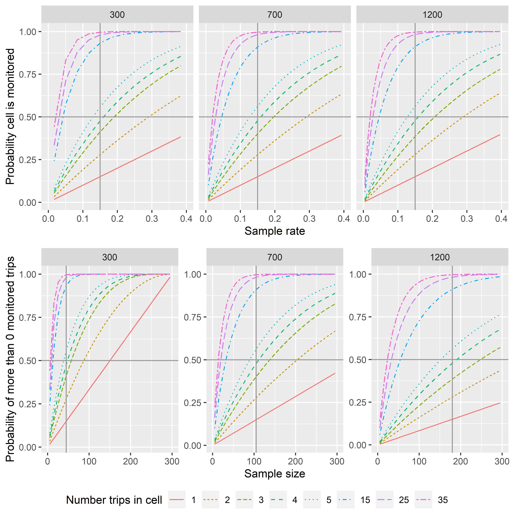
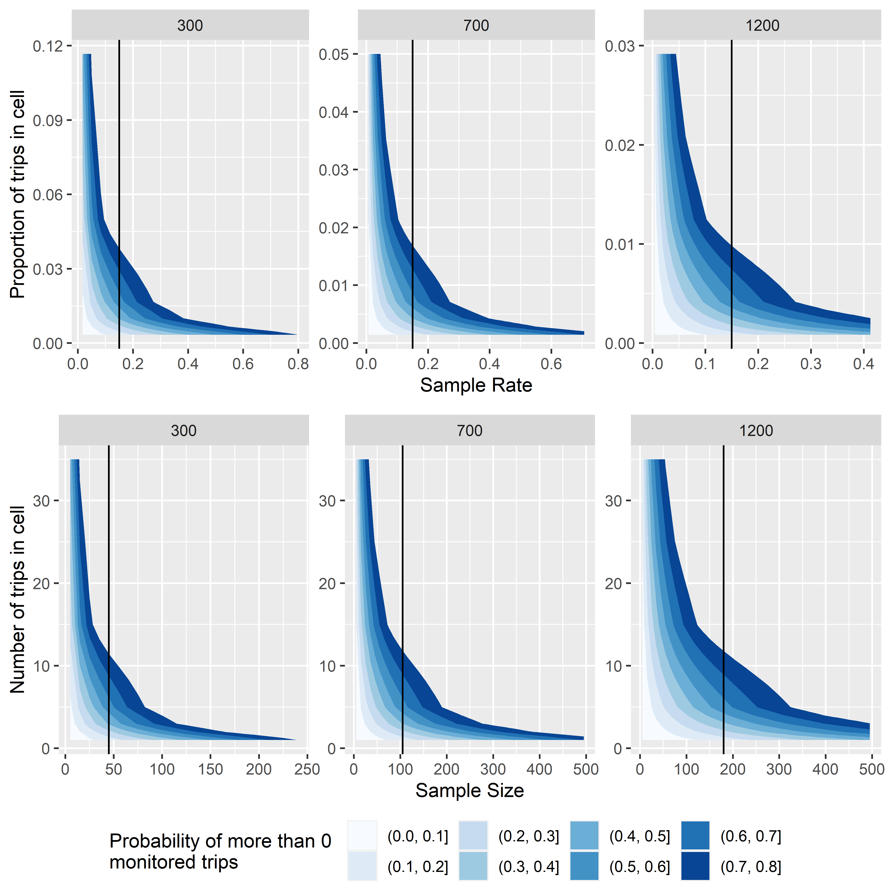
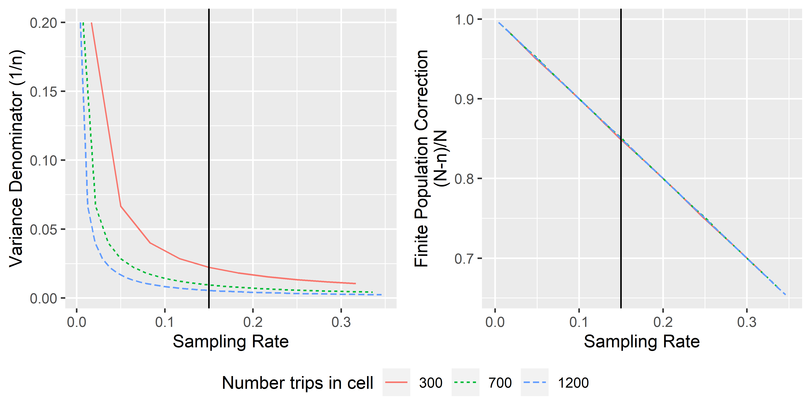
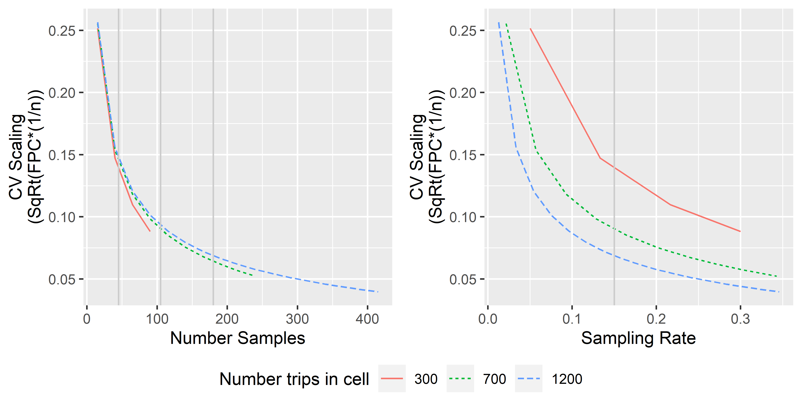

---
title: "Background information related to allocation"
output:
  bookdown::word_document2:
      reference_docx: C:\Users\jennifer.cahalan\Work\JAC Stuff\NPGOP_Sampling\ProjectCode\Good_Code\reference-word-doc.docx
      page_margins:
           bottom: 0.75 
           top: 1
           right: 0.75
           left: 0.75
           header: 0.5 
           footer: 0.5 
           gutter: 0.0 
      keep_md: yes
   
    #bookdown::pdf_book:
     # default
 #bookdown::html_document2:      
 #    toc: true
  #   toc_depth: 2
#     code_folding: hide
---

# Background

three things to consider that could design allocation around
1) sample size - number of units selected - drives variance and probability of
   getting into a box
2) front matter - variance savings that one gets with sample size and sample
   rate (proportion of population sampled)   
3) expansion of trips - how many trips will each sampled trip expand to on
   average
   
To consider - 
sample size, not sample rate, is the primary driver of both the probability of
getting data and the variance.

 

## Probability of selecting a cell

Setting some basic population parameters: *N* is the population size, *K*
is the number of successes in population (the number of fishing trips in the
area of interest), *k_sample* is the number of successes in the sample, and
*n_sample* the sample size.
 
The probability of getting no monitored trips in the area of interest varies
with *K* and sample size. We can compute this using base R and the function
dhyper(*x, m, n, k*) where (from the R documentation) *x* = number of successes
drawn, *n* = number failures in population, *m* = number sucesses in population
(m+n=N=population size), and *k* = number of balls drawn from urn (see Eq.
(2.4) below).

In our application this would be P(*k_sample* = x) = dhyper(x, *K*, *N* - *K*,
*n_sample*)  = *k_sample*. Note that to be consistent with other texts, this
is often noted as phyper(k_lc,N-K,K,n_sample),
see
[https://www.vrcbuzz.com/hypergeometric-distribution-probabilities-using-r/](https://www.vrcbuzz.com/hypergeometric-distribution-probabilities-using-r/)
As an example, if the number of success is *m* = 5, the number of failures is
*n* = 11, and the sample size is *k* = 4, then the probability *P*(*X*=0) should
be dhyper(*0,m,n,k*) =  0.1813187.

If we define a population of 1500 trips where the number of trips in a cell is
1, 2, 5, 10, 20, 30, 40 and sample sizes range from 15 to 490,
we can see how the probability of a sample containing no trips from a given
area changes with sample size (or rate) and the size of the cell
(Figure <a href="#fig:gg-prob0-line-plts">1.1</a>)

Similarly, the probability of a cell containing no data increases with both
decreasing sample rate and the number of trips in a cell (Figure
<a href="#fig:gg-prob0-contour-plts">1.2</a>).

## Impacts of sample size on variance

The variance in estimates from a population is a function of both the sample
size and the overall proportion of the population that is sampled. Thile these
are related quantities, they have different effects on the variance estimate.

All populations have a base variance, Eq (1.1); the variability in
a measured parameter (e.g., length) between sample units. 

$$\begin{equation} 
  Var(x) = \frac{\sum_{i=1}^{N} (x_i - \bar{x})^2 }{N-1}  
  (\#eq:base-var)
\end{equation}$$
$$
The variance of the mean is the base variance (the
population variance or variance of the data) divided by the sample size, Eq.
(1.2). As the sample rate increases, variance will
decrease by \(\frac{1}{n}\). Note that we are not summing only over those sample
units that were sampled, but all samples in the population (i.e., *i* = 1 to *N*
rather than *i* = 1 to *n*)

$$\begin{equation} 
  Var(\bar{x}) = \frac{\sum_{i=1}^{N}{\left(x_i - \bar{x}\right)^2}}{n\left(N-1\right)}  
  (\#eq:var-of-estimate)
\end{equation}$$
$$
Unfortunaly, we rarely know the population variance and must rely variance
estimates fro previous studies or on the sample data only. In estimating the
parameter mean based on a sample, we don't have information from every sample
unit and hence will also need to estimate the variance
(Eq. (1.3). 

$$\begin{equation} 
  V\hat{a}r(\bar{x}) = \frac{\sum_{i=1}^{n}{\left(x_i - \bar{x}\right)^2}}{n\left(n-1\right)}  
  (\#eq:est-var-of-estimate)
\end{equation}$$
$$
We can see the impact of sample size on variance by plotting $\frac{1}{n}$
against the sample rate, \(\frac{n}{N}\), Fig. <a href="#fig:gg-n-fpc-scaling-plt">1.3</a>.

In addition, as we sample a larger and larger portion of the population, our
uncertainty about the estimate decereases. HERE BE THE FPC discussion, Fig.
<a href="#fig:gg-n-fpc-scaling-plt">1.3</a>.

some things to note -
generally don't apply FPC when sample rates below 5%, doesn't make a difference
don't know actual variance - makes sample size analysis challenging, Fig.
<a href="#fig:gg-totl-scaling-plt">1.4</a>.

# Cost-weighted boxes

## Probability of monitoring as a function of sample size

In the
[Cost-weighted Boxes Deployment
Design](https://docs.google.com/document/d/1KxOkCigvOXgbxbzxSeJIGwBzLBWQgVX3iKs1wj4kdhI/edit#)
(<https://docs.google.com/document/d/1KxOkCigvOXgbxbzxSeJIGwBzLBWQgVX3iKs1wj4kdhI/edit#>),
the proposed allocation method is built on having spatial-temporal coverage that
minimizes the proportion of post-strata likely to have no data, weighted by
sampling costs, with the assumption that this will give us the best coverage per
unit cost. 

Starting with the simpler case that ignores costs and is based on the more
traditional minimization of variance. The allocation scheme that minimizes
variance of an estimate, for example the mean \(\bar{x}\), based on a stratified
sample with *h* = 1 to *H* strata and \(\sum_{h=1}^{H}n_h = n\) is the vector of
sample sizes that minimizes the stratified variance estimate (Eq. (2.1)):

$$\begin{equation} 
  V\hat{a}r(\bar{x}) = \sum_{h = 1}^{H}
W_h V\hat{a}r(\hat{x}_{h})\left(\frac{1}{n_h} - \frac{1}{N_h}\right)  
 (\#eq:stratified-variance) 
\end{equation}$$
$$ 
where \(W_h = \frac{N_h}{N}\) and \(n= \sum{n_h}\)

This can be minimized by setting the strata-specific sample sizes,
\(n_h\), proportional to the standard deviation in each stratum. In
otherwords, when \(\frac{n_h}{N_h} = kS_h\) where
\(S_h = \sqrt{V\hat{a}r(\hat{x}_{h})}\) and *k* is a constant such
that\(\sum(n_h) = n\). More specifically, the overall variance will be
minimized when

$$\begin{equation}  
  \hat{n}_{h} = n \frac{w_{h} \sigma_{h}}{\sum_{i = 1}^{H} w_{h} \sigma_i}
  (\#eq:Neyman-sample-size) 
\end{equation}$$
$$
Note that the relies on knowing \(Var(\bar{x})\), which is rarely the case.
Generally, the estimated variance is used under the assumption that the
estimate will accurately reflect the true variability in each stratum. This is
the approach used above. 

Allocation will be optimized when the sample rates in the strata are
proportional to their standard deviations and inversely proportional to the
stratum-specific cost of sampling, Eq.(2.3),
below.

$$\begin{equation} 
  \hat{n}_{h} = n \frac{\frac{w_h \sigma_h}{\sqrt{c_h}}}{\sum_{h
= 1}^{H}\frac{w_h \sigma_h}{\sqrt{c_h}}}   
  (\#eq:Neyman-optimal-sample-size) 
\end{equation}$$
where $c_h$ is the cost associated with sampling stratum *h*.

### One stage deployment
For the cost weighted box design, we would replace \(\sigma_h\) (variance) with
proportion of post-strata within stratum *h* with a less than a pre-specified
probability of having no monitored trips.

The probability of taking a sample of size *n* from a population *N*
total trips where *K* trips are of interest (in a given cell), and getting *k*
successes in the sample is given by (2.4).

$$\begin{equation}
  P\left(X = k\right) = \frac{\binom{K}{k}\binom{N - K}{n - k}}{\binom{N}{n}}
  (\#eq:hypergeom-probability) 
\end{equation}$$

The probability of the sample having no monitored trips in a given cell is given
by (2.5).

$$\begin{equation}
  P\left(k = 0\right) = \frac{\binom{K}{0}\binom{N - K}{n - 0}}{\binom{N}{n}} =
\frac{\binom{N - K}{n}}{\binom{N}{n}} = \frac{(N - K)!}{(N - K - n)!}
  (\#eq:hypergoem-prob-zero) 
\end{equation}$$

If we know these probabilities for each cell in the stratum, we can define a 
"not monitored cell" as any cell where the probability of no data is greater
than *a*, (i.e., \(\geq 0.1\)) based on the the number of trips in the cell
(*K*), total number of trips in the population (*N*), and the sample size (*n*),
Eq. (2.5).

Letting \( I\left(P_i\left(k_i = 0\right) \geq a\right) \) be the indicator of no data, for a given
stratum, we have the proportion of cells with no data as:
$$\begin{equation}
  T_h = \frac{\sum_{i}^{B_h} I_{ih}\left(P_{ih}(k_{ih} = 0) > a\right)}{B_h} 
  (\#eq:proport-cells-no-data-stratum) 
\end{equation}$$
where *i* from 1 to *B* indexes the total number of cells in the stratum.

Intuitively, we want to allocate more sample to strata that have a higher
proportion of cells with few trips (*i.e.*, strata where there are a higher
number of cells where *K* is small relative to *N*, see Figure
<a href="#fig:gg-prob0-line-plts">1.1</a>). 

Refering back to our original minimization problem and substituting in
for\(P_i(k_i = 0)\), we could find the set of \(n_h\) that minimizes the sum
over all strata of having no data, *i.e., minimizes
(2.7).
$$\begin{equation}
  \bar{T} = \frac{1}{H} \sum_{h}T_h = \sum_{h}
\left[\frac{\sum_{i}^{B_h} I_i\left(\frac{(N_{h} - K_{ih})!}{(N_{h} - K_{ih} - n_{h})!} > a\right)}{B_h}\right]
  (\#eq:mean-proport-cells-no-data-stratum) 
\end{equation}$$

Intuitively, we want to allocate more sample to strata that have a higher
proportion of cells with few trips (*i.e.*, strata where there are a higher
number of cells where *K* is small relative to *N*, see Figure
<a href="#fig:gg-prob0-line-plts">1.1</a>). 

By using the mean of the proportions, \(T = \frac{\sum{T_h}}{H}\) (Eq.
(2.7)), each stratum would be weighted
equally while using the sum of the proportions (divided by the total number of
boxes, *i.e.*, the weighted mean), sampling strata with larger numbers of cells
will contribute more to the overall proportion (metric being minimized). 

$$\begin{equation}
  \bar{T} = \frac{\sum_{h}\sum_{i}^{B_h} I_{ih}\left(P_{ih}(k_{ih} = 0)
\geq a\right)}{\sum_{h}{B_h}} = \frac{\sum_{h}\sum_{i}^{B_h}
I_{ih}\left(\frac{(N_{h} - K_{ih})!}{(N_{h} - K_{ih} - n_{h})!} >
a\right)}{\sum_{h}B_h} 
  (\#eq:proport-ALL-cells-no-data-stratum) 
\end{equation}$$

For a given set of strata, with population sizes for each stratum, \(N_h\), and
numbers of trips in each box in each stratum, \(K_ih\), we need to estimate the
sample sizes for each stratum, \(n_h\), that minimizes \(\bar{T}\) under either
(2.7) or
(2.8). 

*If our goal is to minimize the total number of cells without
data(across strata), Eq. (2.8), weighted
mean proportion is the more appropriate metric. If we want to ensure that we
minimize the proprtion of cells without data in each stratum, the mean of the
proportions metric is more appropriate.*

#### Cost optimized

If we want to "optimize" this in terms of costs of sampling, then we need to
incorporate the differential costs associated with each stratum, balancing
costs with the probability of not getting data.

$$\begin{equation}   
  \bar{T} = \frac{1}{H} \sum_{h}T_hC_h 
 (\#eq:cost-weighted-boxes) 
\end{equation}$$

Where \(C_h\) is the mean cost per unit of sampling in stratum *h* and we need
to minimize \(\bar{T}\).

It is not obvious how to solve for \(n_h\) and so we use simulation.

### Two-stage deployment

In this version, 

is defined as the rate at which the proportion of post-strata that have a
prespecified probability of having at least one trip (or delivery) monitored. 

Rank areas by the number of trips in each; areas will add into the proportion
in that order, causing stair steps in some cases.

for a given number of post-strata (areas), each with a given number of trips,
the sample size needed to acheive a pre-specified \(P(X=0)\) is difficult to
compute since it involves solving the probability for *n*: 

\[
P(X=0) = \frac{(N-K)!(N-n)!}{(N-K-n)!N!}
\]

In addition, this will vary for each post-strata based on the number of trips
in the post-strata. However, after a lot of math, we notice that only some
terms vary with n and that some factorials cancel,leaving only falling products.

For example, \[frac{(N-K)!}{N!}]\] equals the falling product from *N* to
*N-K+1*, \[prod_{x = a}^{b} f(x)\]

# SEA-ish design (awaiting new name?)

## from teh analytic document
Sample rates such that we *maximize* the percentage of trips that occur in those
boxes that have greater than a predetermined probability of 1 or more trips per
post-stratum (inspired by SEA methods of Gasper et al. 2017). Final sample rates
are likely to differ between strata, but an important feature of this design is
that strata are set to be equal in terms of their data resolution outcome.

We would change the percentage of trips (currently 75%) contained within
post-strata with greater than 50% probability of having one trip, not the
probability of having one trip observed. The different strata are likely to
“respond” differently as that proportion changes (could plot this). Use
hypergeometric distribution to estimate the probability of having one trip in a
post-strata (instead of conducting simulation analysis). 

Post-strata definitions will impact expected gap sizes and data resolution;
larger post-strata will result in lower data resolution but perhaps fewer gaps.
Hence, in considering post-strata definition, we can use 2 or 3-weeks temporal
bins instead of 1 week and/or could drop/bin trip target and compare results to
assess advantages of different post-stratification definitions or impacts of
differing sample rates.)

## from geoff's description

define a set of hexagons 
    * note that placement of hex centers will impact the numbers of trips in
each, hence allow 'overlapping' neighborhoods.     
* identify the 6 hexagons immediately adjactent to hex-of-interest
    * determine the whether each trip in the center hex has a sampled
      neighbor in either the center hex or the surrounding hexes. 
      * computed as the sample rate^number of trips
    * 
    

